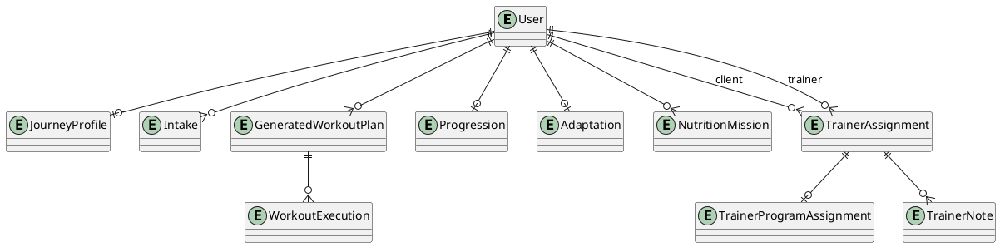

# Domain model

The persistence unit for most member concepts is the **user aggregate** in `data/users/<userId>.json`; names below describe logical entities even where they are embedded rather than separate tables.

## Entities

| Entity | Purpose and lifecycle | Ownership | Relationships | Source of truth |
|---|---|---|---|---|
| **User** | Authentication principal and aggregate root. Created/loaded at registration, login, bridge, or first write; updated as member data changes. | The authenticated user; admins receive only explicitly authorized views. | Contains profile, events, sessions, intake, plans, nutrition, and progress concepts; referenced by trainer workspace IDs. | `data/users/<userId>.json`; role is **not** sourced here but from authorization environment configuration. |
| **Journey Profile** | Stable, derived view of submitted intake used for personalization. Recomputed/versioned when a valid intake is submitted. | Member. | Derived from Intake; consumed by personalization, Member Home, plan generation. | Derived/persisted user aggregate state managed by `journeyIntakeService`. |
| **Intake** | Versioned onboarding answers, draft completeness, validation, and submission state. Draft is patched until submit; later submissions preserve version semantics. | Member. | Produces Journey Profile and recommendations. | User aggregate managed by `journeyIntakeService`; validators define accepted fields. |
| **Generated Workout Plan** | Deterministic schedule/exercise prescription produced from member inputs. Generated after qualifying intake and read as the current plan. | Member; trainer program is a distinct overlay/assignment. | Uses Journey Profile/recommendations; parent of executions and input to progression. | User aggregate managed by `generatedWorkoutService` and plan builder. |
| **Workout Execution** | In-progress/completed performance against a generated workout. Created, patched as sets/exercises advance, completed once. | Member. | References generated plan/workout; supplies progression/adaptation evidence. | User aggregate managed by `generatedWorkoutService`; legacy sessions remain a separate compatible execution record. |
| **Progression** | Current recommendation/proposal and acceptance history for workload change. Evaluated from completed execution evidence; proposed changes become effective only when accepted. | Member. | Reads executions and plan; feeds later prescription. | User aggregate managed by `generatedWorkoutProgressionService` and progression config. |
| **Adaptation** | Read model explaining recovery/performance-driven training adjustment. Recomputed from recent execution and progression evidence. | Member. | Depends on execution/progression; shown by Member Home. | Derived/persisted user state managed by `trainingAdaptationService`. |
| **Nutrition Mission** | Actionable goal generated for a weekly nutrition plan. Generated from a plan, manually or event-progressed, patched through active/completed lifecycle. | Member. | Belongs to weekly plan; relates to grocery items, meals, entries, and review. | Nutrition section of user aggregate managed by `nutritionService`. |
| **Trainer Assignment** | Grants a trainer access to one client. Created idempotently as active; deletion deactivates and records actor/time rather than erasing history. | Administrator controls lifecycle; referenced trainer gains scoped access. | Links trainer User and client User; gates program and note access. | `data/trainer-workspace.json` `assignments[]`. |
| **Trainer Program Assignment** | Trainer-authored current program payload for an assigned client. Replaced through the PUT route while preserving author/update metadata in member state. | Assigned trainer for that client; client remains subject of program. | Requires active Trainer Assignment; complements generated member plan. | Client user aggregate, written through `trainerWorkspaceService`. |
| **Trainer Note** | Trainer-private chronological observation. Append-only in public API; logically deletable in storage but no delete route is exposed. | Authoring trainer; access is constrained to that trainer plus active client assignment. | Links trainer/client and assignment context. | `data/trainer-workspace.json` `notes[]`. |

## Supporting concepts

Profiles, OHSA submissions, baseline goals, weekly check-ins, visual scans, legacy programs/sessions, memberships, nutrition entries/meals/weekly plans, challenge results, exercise templates, diagnostic reports, token revocations, and enforcement overrides are additional persisted concepts. They share the ownership and storage rules documented in [storage](storage.md) and route contracts in the [API reference](../api/api-reference.md).
