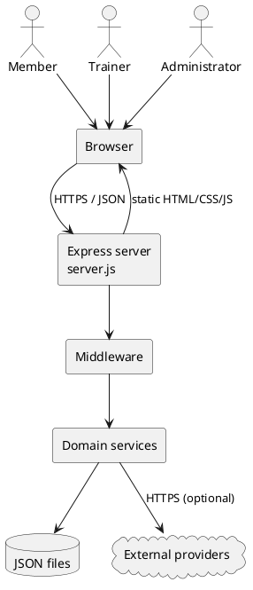
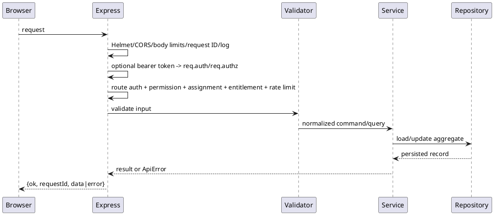

# Pocket PT system architecture

This document describes the current Node.js MVP. It is descriptive, not a target-state design. See the [domain model](domain-model.md), [storage](storage.md), [code inventory](code-inventory.md), [API reference](../api/api-reference.md), and [authorization model](../security/authorization.md).

## High-level architecture

Pocket PT is one Express process that serves static browser assets and a JSON API. Browser modules call same-origin APIs with bearer credentials. Express middleware establishes request, authentication, authorization, rate-limit, and membership context; services implement use cases; repositories persist JSON. Optional outbound adapters call Stripe, USDA FoodData Central, Open Food Facts, a speech provider, Google identity verification, and OpenAI diagnostics.

## Application layers

| Layer | Responsibility |
|---|---|
| Browser (`public/`) | Pages, runtime orchestration, safe rendering, member/trainer/admin workflows, pose/form analysis, API calls. |
| Composition (`server.js`) | Environment parsing, dependency construction, middleware ordering, route handlers, static delivery, startup. |
| Middleware (`src/middleware`) | Request IDs/error wrapping, bearer authentication, permission/ownership checks, in-memory rate limits. |
| Validation (`src/validation`) | Reject malformed or prohibited request fields before a service write. |
| Services/engines (`src/services`, `src/workouts`) | Journey, recommendation, plan generation, progression, adaptation, nutrition, membership, trainer, and session use cases. |
| Repositories (`src/repositories`) | User aggregates and trainer workspace persistence. |
| Infrastructure (`src/lib`) | Tokens, authorization, audit, enforcement state, diagnostics, trust policy, response envelopes. |

## Request lifecycle

Unknown API routes return an API error; the final error handler converts operational errors to status-coded JSON and avoids leaking secrets. Static middleware is mounted after protected API/page routes.

## Authentication flow

`POST /api/auth/login` validates the configured pilot principal/password and issues a signed bearer token. Registration creates a local user identity; the bridge route accepts only identities permitted by the configured trust policy. Clients retain the token and send `Authorization: Bearer <token>`. `authContext` verifies signature, expiry, maximum TTL, and denylist state, then resolves the role. Logout is client-facing; operators can revoke a token JTI through the protected operations API. `/api/auth/me` returns the current identity when authenticated.

## Authorization flow

Roles are derived from environment allowlists, not mutable user JSON. Route middleware first requires authentication, then a permission where applicable. `/api/me/*` and member routes always use `req.auth.userId`; supplied cross-user identifiers are rejected. Trainer client routes additionally require an active assignment. Administrator routes require the assignment-management permission. Membership-gated routes add an entitlement check. See [authorization](../security/authorization.md).

## Workflows

### Member

1. Authenticate and complete the versioned retention intake.
2. Submit intake; the server derives Journey Profile and deterministic personalization/recommendations.
3. Retrieve Member Home and generated plan; start, update, and complete executions.
4. Evaluate/accept progression; adaptation derives from accumulated evidence.
5. Log nutrition, create weekly plans, generate/advance missions, and review the week.

### Trainer

1. Authenticate with a configured trainer identity and open the protected workspace.
2. List only assigned clients; an active assignment is checked again for every client-specific route.
3. Review the client summary/program, replace the trainer program assignment, and append trainer-private notes.

### Administrator

1. Authenticate with an admin/super-admin identity.
2. Search user/trainer directory through assignment endpoints, create idempotent active assignments, or deactivate them.
3. Authorized operators inspect diagnostics/audit/enforcement; break-glass also requires bootstrap super-admin status and a reason.

## Data persistence

Member state is aggregated in `data/users/<userId>.json`; trainer assignments and notes use `data/trainer-workspace.json`; operational data lives under `data/ops/`. Exercise definitions under `public/exercise-db/` are deploy-time reference data. Persistence is synchronous and local. Some stores use temp-file-plus-rename; user records and several operational stores currently overwrite directly. Full details and concurrency caveats are in [storage](storage.md).

## Security boundaries

* **Internet to reverse proxy:** TLS termination, request sizing, timeouts, and edge controls.
* **Browser to Express:** CORS allowlist, Helmet, JSON size limits, bearer authentication, validation, output policy, and rate limits.
* **Express to disk:** validated safe user IDs; process OS permissions are the final boundary. Never expose `data/` as static content.
* **Express to providers:** server-only secrets and HTTPS; webhook signatures protect Stripe ingress.
* **Trainer/admin boundary:** permissions plus active assignment ownership; administrative activity is audited.

## Browser/client architecture

Pages are server-served HTML with modular plain JavaScript rather than a bundled SPA. `app-core`, `boot-core`, `runtime-state/events/orchestrator`, and hydration modules coordinate startup. Feature runtimes isolate Journey, member home, workouts, progression, nutrition, pose/form, and avatar behavior. `auth-core`, `auth-state-runtime`, `backend-read`, `session-write`, and `profile-write-runtime` form the API/auth boundary. `safe-rendering` centralizes untrusted-content rendering. Trainer and administrator pages have dedicated navigation and modules.

## API organization

The API is route-oriented beneath `/api`: auth, current-user (`/api/me`), trainer, admin, nutrition, sessions/workouts, programs/progress, exercise catalog/templates, billing, and operations/diagnostics. `/health`, version/smoke routes, `/command`, and protected HTML routes are compatibility or operational surfaces. See the exhaustive [API reference](../api/api-reference.md).
