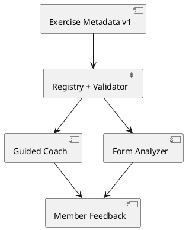

# Versioned exercise metadata

`public/exercise-metadata.js` is the authoritative, browser-safe CommonJS/UMD metadata bundle (asset version `20260725-em1`, schema version 1). The application has no browser build step, so one versioned static module avoids asynchronous per-profile fetches and stale mixed-schema files while remaining directly importable by Node tests and the offline validator.

## Architecture

The public future-Studio boundary is `listExerciseProfiles()`, `getExerciseProfile(id)` on a registry, plus `validateExerciseProfile(profile)` and `validateExerciseRegistry(profiles)` on the module. A future authenticated trainer tool can edit a detached draft, validate it, arrange qualified review, then publish a new versioned bundle. Login, editing, review workflow, persistence, and publishing are intentionally not implemented.

## Schema

Each profile contains: `schemaVersion` (format revision), `exerciseId` (canonical lowercase underscore ID), `profileVersion` (content revision), `displayName`, `aliases`, `approval {status, reviewerId, reviewedAt, notes}`, `instruction {setupCues, movementCues, safetyCues}`, `cadence {phaseOne, hold, phaseTwo}`, `phrases` pools (`encouragement`, `positiveForm`, `correctiveForm`, `uncertainForm`, `completion`, `recovery`) whose entries are `{id, template, supportsName}`, and `poseAnalysis {supported, requiredView, minimumUsableFramePercentage, minimumOverallConfidence, rules}`. Rules contain `id`, deterministic `type`, `measurement`, MoveNet `landmarks`, `thresholds`, minimum landmark confidence, minimum affected-frame percentage, minimum consecutive duration, unique priority, and owned phrase-ID references for good/needs-attention/uncertain feedback.

Approval statuses are `draft`, `trainer_reviewed`, and `approved`. Approved metadata requires a nonempty reviewer ID and valid review timestamp. Runtime corrective analysis additionally requires `approved`; all migrated profiles truthfully remain draft. Cat-Cow, Dead Bug, and Dumbbell Bicep Curl are `not_supported` because the present alignment measurement and MoveNet landmarks do not establish reliable exercise-specific judgments (notably precise spinal curvature).

## Validation and safety

The deterministic validator reports `{valid, errors, warnings}` with exercise ID, field path, stable code, and message. It rejects unsupported schema versions, malformed identity/version fields, alias/canonical collisions, unsafe or oversized text, unknown placeholders, invalid approval, invalid ranges/views/rules/measurements/landmarks, duplicate IDs/priorities, missing thresholds, cross-profile feedback references, and rules on unsupported profiles. `{nameSuffix}` is the only placeholder. HTML, script-like text, and member data are not accepted. The bundle contains no identity, pose session, video, frame, token, or raw landmark data.

Normalization trims, lowercases, converts whitespace/hyphens to underscores, and collapses underscores; canonical IDs, display names, and explicit aliases are indexed once. Unknown IDs return one frozen, nonjudgmental generic profile and are never registered. Profiles are recursively frozen; personalization operates on selected template strings rather than stored data.

Metadata and validation initialize once, before coach/form runtimes. No fetch, network, camera, TensorFlow, timer-tick parsing, or pose-frame validation occurs. Existing single pose loop and speech coordinator are unchanged. Browser caches are coherently busted by `20260725-em1` (metadata), `20260725-em-wc1` (coach), and `20260725-em-fr1` (form). Expected mobile cost is one small static script and one initialization; production iPhone Safari performance remains owner-validation blocked.
