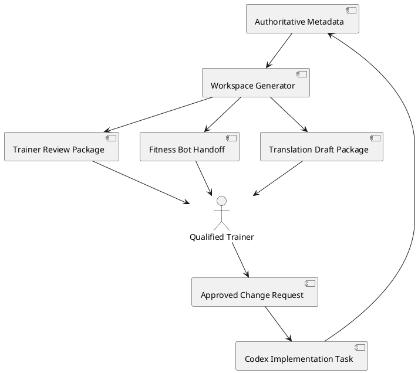

# Exercise review workspace

## Boundary and regeneration

`public/exercise-metadata.js` is the single authoritative production source. `scripts/generate-exercise-review-workspace.js` validates that registry and deterministically replaces `exercise-review/` using the existing review-export fingerprints. Run `npm run generate:exercise-review-workspace`; generated profiles are detached snapshots, decisions are human paperwork, and neither can mutate runtime metadata.

No timestamps, randomness, network, browser, camera, TensorFlow, member data, preferred names, observations, images, or video enter generation. Stable registry order and two-space JSON make identical inputs byte-identical. A schema version, profile version, or fingerprint mismatch makes a response stale and blocks implementation.

## Workflows and authority

The qualified trainer reviews `review.md`, the exact `profile.json`, optional Fitness Bot proposals, and translation drafts, then completes `trainer-decision.md`. The Fitness Bot is only a secondary content reviewer: it may recommend and draft translations, but may not approve, publish, alter production status, invent credentials, apply metadata, or change deterministic pose logic. `npm run validate:fitness-bot-review -- <file>` only establishes “structurally safe for human review”; there is deliberately no apply command.

After a signed decision, Codex must independently verify its exact version and fingerprint, implement only explicitly approved changes in the authoritative file, increment the profile version for content changes, validate, regenerate a new fingerprint, and return changed content for review. It must never infer approval from checked-in artifacts.

## Translation workflow

The confirmed current source content is English (`en-US`). Translation packages contain only display name, setup/movement/safety cues, cadence words, and phrase IDs/templates. Identity, versions, fingerprint, approval, pose support, landmarks, measurements, confidence, thresholds, persistence, views, and priorities are protected and cannot be overridden.

Every draft stays `draft_pending_human_approval` and separate from runtime. Before publication it requires structural validation, placeholder validation, phrase-ID coverage, no missing source strings, no unauthorized extras, safety-meaning review, trainer review, fluent/native-language review when available, an exact version/fingerprint match, and separate publication approval. A future static-browser-friendly layout is `exercise-locales/<locale>/<exerciseId>.json`, bundled synchronously with a release; no asynchronous loader or build system is needed now.

## Components

