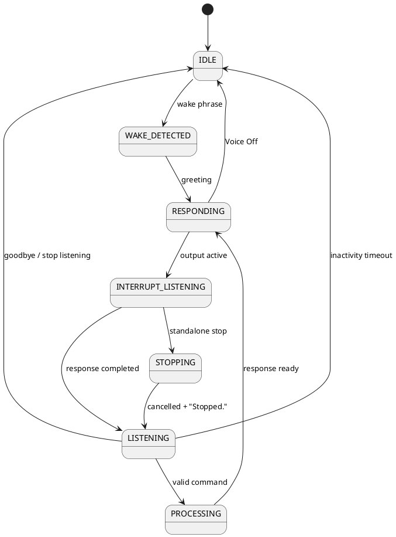

# Pocket PT controlled conversational speech

Pocket PT owns one `SpeechRecognition` instance. Voice mode (`listening`) and the conversational session are separate: in `IDLE`, ordinary transcripts are discarded and a wake phrase is required. During assistant output recognition remains available only as an interruption listener. If a browser suspends recognition during output, the response remains non-interruptible on that browser rather than allowing ordinary speech to cancel it.

## State machine

`RESPONDING` and `INTERRUPT_LISTENING` are represented by `RESPONDING` plus active-speech metadata in the runtime. In that mode, only exit intent and conservative stop intent are actionable; no ignored transcript is replayed.

## Intent and precedence

While speaking, precedence is **Voice Off > `stop listening`/`goodbye` > standalone `stop` > discard**. Accepted stop forms are `stop`, `stop.`, `stop!`, `Mufasa stop`, `Hey Mufasa stop`, and `coach stop`. Token equality is required. Rejected forms include `do not stop`, `don't stop`, `keep going and don't stop`, `stopwatch`, `stopping`, `I stopped earlier`, and `my workout stopped`.

A standalone stop cancels only the active interruptible response, invalidates its continuation, says “Stopped.” once, and returns to session listening. `stop listening`, `goodbye`, `cancel`, `end conversation`, `that's all`, and `that is all` end the session. Voice Off cancels output without acknowledgment, stops recognition, clears timers/state, and prevents `onend` from restarting it.

## Ownership and boundaries

Every active response has an internal utterance ID, owner (`conversation`, `guided_coach`, `workout_voice`, or `system`), source, start time, interruptible flag, and completion/cancellation reason in the bounded trace. Conversational stop targets only the active interruptible response. Overlapping Workout Voice cues are rejected rather than cancelling conversation output; it does not change Workout Voice or Guided Coach preferences, workout timers, or progression. A Guided Coach explanation spoken as an interruptible conversational response can be stopped, but its preference is unchanged.

## Session timeout

The configurable defaults are 30 seconds to timeout and an optional warning near 20 seconds (`conversationWarningEnabled`, `conversationWarningMs`, and `conversationTimeoutMs`). A valid command, completed response, or completed stop acknowledgment resets inactivity. Timers do not expire during active output. The warning, “I'm still here if you need me,” occurs at most once per cycle and is timer-neutral. Final timeout says “Okay, I'll stop listening,” stops recognition cleanly, clears conversation timers, and returns to `IDLE`; Voice On and a wake phrase are then required again.

## Trace and privacy

The 100-entry bounded trace includes state changes, response start/completion/cancellation, interruption mode, ignored classification, stop detection/acknowledgment, warning/timeout, and recognition resume events. Entries include timestamp, module, conversation state, owner/ID, normalized intent, cancellation reason, and normalized errors where applicable. Raw transcripts and response text are not retained in trace entries; ignored audio is only `ignored_non_stop_transcript`.

## Manual real-browser validation (not yet performed)

Release remains blocked until these are performed on real browsers. Never mark a row passed from automated simulation.

### Desktop Chrome and iPhone Safari

1. Record browser/version, device/OS, microphone permission, and whether Voice On starts the singleton recognizer.
2. Enable Voice On; say “Hey Mufasa”; request a long response.
3. Speak ordinary words and commands over it; verify output continues and no command dispatches.
4. Say “stop”; verify immediate cancellation and exactly one “Stopped.”
5. Give a follow-up without wake; verify it works.
6. Wait through warning and final timeout; verify the warning occurs once and wake is required afterward.
7. Record AudioContext state, backend-audio result, browser-synthesis fallback result, and recognition availability during TTS.
8. On iPhone Safari specifically, record whether Web Speech recognition remains available during TTS. If it is suspended or unsupported, document that stop cannot be detected mid-output and confirm full output remains reliable.

Repeat the same evidence capture on Android Chrome, desktop Safari, Edge, and Firefox. Current support status for every listed browser is **NOT TESTED**; Web Speech API availability and recognition-during-output behavior must be established on the actual target version/device.
