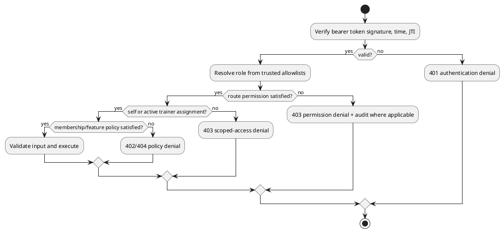
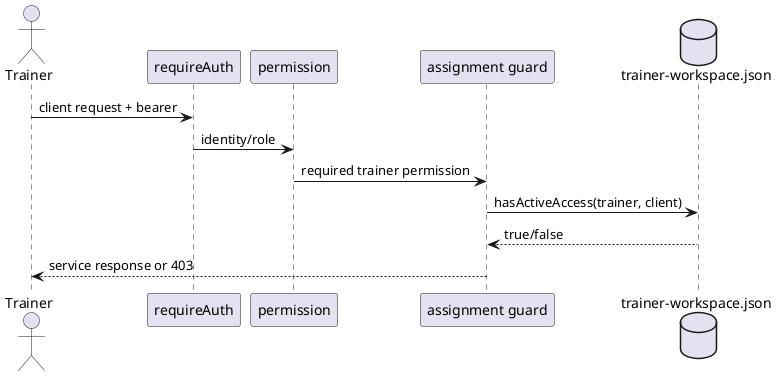

# Authorization model

This is the runtime access-control contract. Authentication proves an identity; authorization resolves that identity to a role/permissions and applies route, ownership, assignment, entitlement, feature, output, and rate-limit policies.

## Roles and permissions

| Role | Permissions |
|---|---|
| `user` | No privileged permissions; may use authenticated, self-owned member routes. |
| `trainer` | `trainer.workspace.read`, `trainer.clients.read`, `trainer.clients.programs.write`, `trainer.clients.notes.read`, `trainer.clients.notes.write`. |
| `admin` | All currently defined permissions, including trainer and operations/assignment administration. |
| `super_admin` | All permissions; additionally eligible for explicitly coded break-glass operations. |

Role resolution order is bootstrap super-admin user ID/provider subject, configured admin ID/subject, legacy admin email allowlist, configured trainer ID/subject, then `user`. Configure these with `AUTHZ_BOOTSTRAP_SUPER_ADMIN_*`, `AUTHZ_ADMIN_*`, `AUTHZ_TRAINER_*`, and (compatibility) `ADMIN_EMAILS`. Roles are deployment configuration, not claims accepted blindly from member JSON or request bodies.

## Route protection and ownership

* `authContext` may establish identity for all requests; `requireAuth`/critical-route auth rejects missing or invalid tokens.
* Current-user and member routes derive the subject from `req.auth.userId`. A caller cannot select another user by body/query ID. Safe ID validation also prevents path traversal.
* Session/execution IDs are resolved within that member's aggregate, so knowing another member's ID is insufficient.
* Membership-gated workout/session/nutrition/progress routes return `402 membership_required` unless membership grants access. Admin/operator bypass and a test-only bypass are explicit.
* Protected HTML (`trainer.html`, admin assignments, dashboard, exercise library, nutrition) is guarded before static middleware.
* Public routes are limited to landing/static assets, health, permitted exercise catalog/challenge output, auth boundaries, and signed provider webhook. Consult the [API reference](../api/api-reference.md) rather than assuming `/api` is private or public as a whole.

## Trainer assignment rules

A trainer permission alone permits workspace/list use, but every `:clientUserId` route also calls the active assignment guard. Assignment state must contain the same trainer ID, client ID, and `status: active`. Notes are further filtered to the authoring trainer/client pair. Deactivating an assignment immediately removes client detail, program, and notes access; historical records remain. Trainer write endpoints have a dedicated limiter.

## Administrator permissions

`admin.trainer_assignments.manage` permits listing, creating, and deactivating trainer assignments. Operations reads/changes separately require `ops.read_observability`, `ops.read_authz`, or `ops.manage_enforcement`. Break-glass updates require both enforcement permission and bootstrap `super_admin`, plus a recorded reason. Administrative authorization decisions and sensitive changes feed the audit/observability systems.

## Feature flags and enforcement controls

| Control | Effect |
|---|---|
| `ENABLE_AVATAR_FEATURE` | Enables avatar runtime/upload; disabled behavior does not expose the asset route. |
| `BILLING_ENABLED`, `STRIPE_LIVE_MODE` | Enables billing integration/mode; secrets and matching keys are startup concerns. |
| `ENABLE_TTS_NO_AUTH` | Low-trust TTS path; must remain `false` in production. |
| `AUTH_BRIDGE_ALLOW_MANUAL`, `AUTH_BRIDGE_ALLOW_UNVERIFIED_GOOGLE` | Relax bridge trust; must remain `false` in production. |
| `LEGACY_FALLBACK_ENABLED` and per-action enforcement variables | Controls deprecated `/command` compatibility and whether explicit authenticated routes are required for `profile`, `session_start`, `session_complete`, `ohsa`, `rep_update`. |
| `CONTROL_PLANE_STRICT_STARTUP` | Makes control-plane preflight failures block startup. |
| `MEMBERSHIP_GATE_TEST_ENFORCED` | Test-only entitlement behavior; do not use as a production bypass. |

Runtime enforcement overrides are versioned and permission-protected; forced break-glass changes are audited. The exact complete environment inventory is in the [deployment guide](../deployment/deployment-guide.md).

## Output policies

Responses fall into `public-safe`, `authenticated-safe`, and `sensitive-private` classes in `config/route-authorization-contract.js`. Public output must contain no profile, token, diagnostic, filesystem, or provider-secret material. Authenticated-safe output may expose the caller's operational state; sensitive-private output is self/assignment/privilege scoped. Errors should use stable codes/messages, a request ID, and sanitized details; auth headers, tokens, payment credentials, and provider secrets must never be logged or reflected.

## Rate limits

Rate limiters are fixed-window, in-memory, per process and keyed by client/request identity according to middleware configuration. Named limits cover authentication, TTS, pilot telemetry, challenge results, legacy command, trainer writes, and selected control-plane actions. Exceeding a limit returns `429`. Counters do not survive restart and cannot coordinate multiple processes; the reverse proxy should add distributed/IP abuse controls. Environment-specific numeric defaults are defined at server composition time and should be verified before release.

## Denial/status contract

Common outcomes are `401` missing/invalid/expired/revoked token, `402` missing membership, `403` role/permission/assignment denial, `404` absent or feature-hidden resource, `409` version/state conflict, `429` rate limit, and `400` validation failure. Do not use a `404` response alone as evidence that a route is public or absent.
